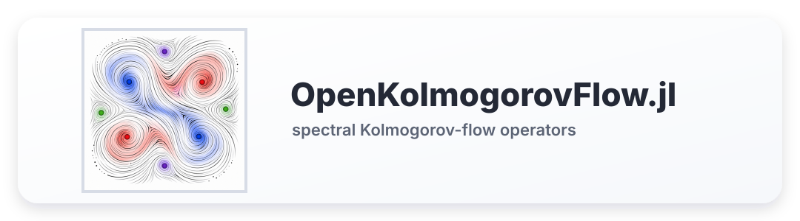

<p align="center">
  
</p>

# OpenKolmogorovFlow.jl

[](https://davide-lasagna-s-lab.github.io/OpenKolmogorovFlow.jl/dev/)

OpenKolmogorovFlow.jl implements the spectral right-hand-side operators used to
study the two-dimensional open Kolmogorov-flow vorticity equation on a periodic
square. It provides physical and Fourier field containers, dealiased FFTs,
spectral derivatives, forward/tangent/adjoint equations, forcing objects,
diagnostics, and symmetry operations.

Time integration is provided by
[Flows.jl](https://github.com/Davide-Lasagna-s-Lab/Flows.jl), whose manual is
available at
[davide-lasagna-s-lab.github.io/Flows.jl](https://davide-lasagna-s-lab.github.io/Flows.jl/stable/).
In practice, OpenKolmogorovFlow.jl defines the equation objects and
`splitexim` interface; Flows.jl supplies the IMEX schemes, monitors, storage,
and propagation loops.

## Installation

These packages are currently used as unregistered Julia packages. From a Julia
project where you want to run simulations:

```julia
import Pkg

Pkg.develop(url="https://github.com/Davide-Lasagna-s-Lab/Flows.jl.git")
Pkg.develop(url="https://github.com/Davide-Lasagna-s-Lab/OpenKolmogorovFlow.jl.git")
Pkg.instantiate()
```

Inside a local checkout of OpenKolmogorovFlow.jl, use the package project and
develop Flows.jl into that environment:

```julia
import Pkg

Pkg.activate(".")
Pkg.develop(url="https://github.com/Davide-Lasagna-s-Lab/Flows.jl.git")
Pkg.instantiate()
```

## Small Run

```julia
using Flows
using OpenKolmogorovFlow

n = 10
m = up_dealias_size(n)
Re = 1.25
kf = 4

Ω = FTField(n, m)
equation = ForwardEquation(n, m, Re, kf)
explicit, implicit = splitexim(equation)

method = CB3R2R3e(Ω, Flows.NormalMode())
integrator = flow(explicit, implicit, method, TimeStepConstant(0.01))

Ω .= 0.01
Ω[WaveNumber(0, 0)] = 0
integrator(Ω, (0.0, 50.0))

error = normdiff(Ω, laminarflow(n, m, Re, kf))
```

The documentation explains what `n` and `m` mean, how Fourier modes are stored,
how to build analytic fields, and how the equation objects connect to
Flows.jl:

https://Davide-Lasagna-s-Lab.github.io/OpenKolmogorovFlow.jl/dev/
