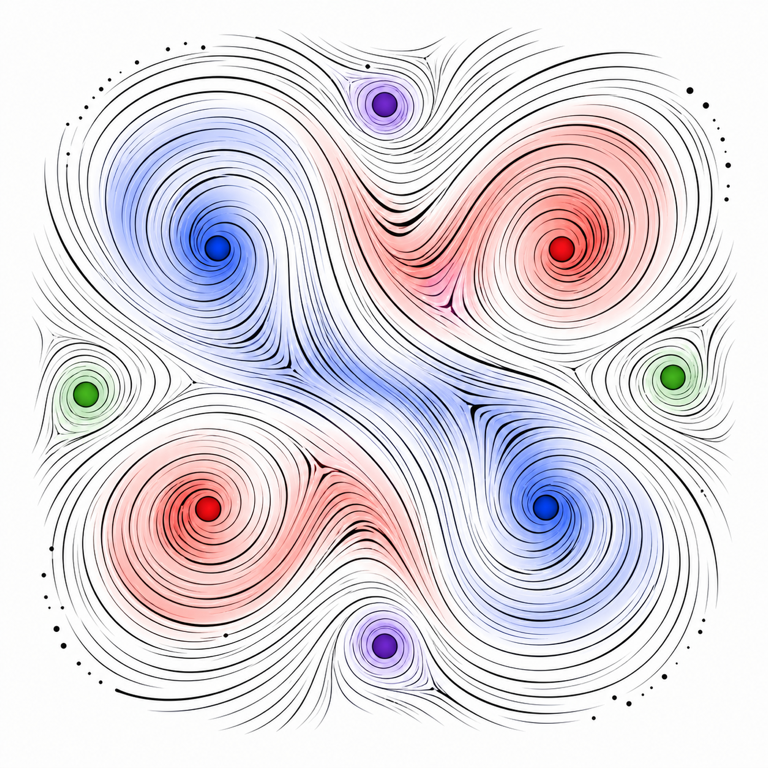

```@meta
CurrentModule = OpenKolmogorovFlow
```

```@raw html
<p align="center">
  
</p>
```

# OpenKolmogorovFlow.jl

OpenKolmogorovFlow.jl contains spectral solver utilities for the
two-dimensional open Kolmogorov-flow vorticity equation on a periodic square.
It provides field containers, Fourier transforms, differential operators,
forward/tangent/adjoint equations, forcing objects, diagnostics, and symmetry
maps.

The package is deliberately small and operator-oriented. It is not a complete
time-stepping framework by itself: it defines the field types and equation
operators, while [Flows.jl](https://github.com/Davide-Lasagna-s-Lab/Flows.jl)
provides the integrators, monitors, and trajectory storage. Most numerical
operations are mutating, preallocated functions with names ending in `!`, which
lets time-stepping code reuse storage instead of allocating new arrays at every
stage.

```@docs
OpenKolmogorovFlow
```

## Start Here

If you are new to the package, read [Getting Started](man/getting-started.md)
first. It shows how to install the unregistered packages, create a field, build
a forward equation, run it with Flows.jl, and check the result against the
analytic laminar solution.

## Contents

- [Getting Started](man/getting-started.md): installation and a complete small
  run.
- [Assumptions](man/conventions.md): domain, Fourier layout, truncation, and
  mutating conventions.
- [Fields](man/fields.md): physical fields, Fourier fields, grids, transforms,
  and dealiasing.
- [Equations](man/equations.md): forward, tangent, adjoint, implicit, and
  forcing objects.
- [Symmetries](man/symmetries.md): shifts, rotations, diagnostics, and spectra.
- [Reference](man/api.md): the documented public API.
